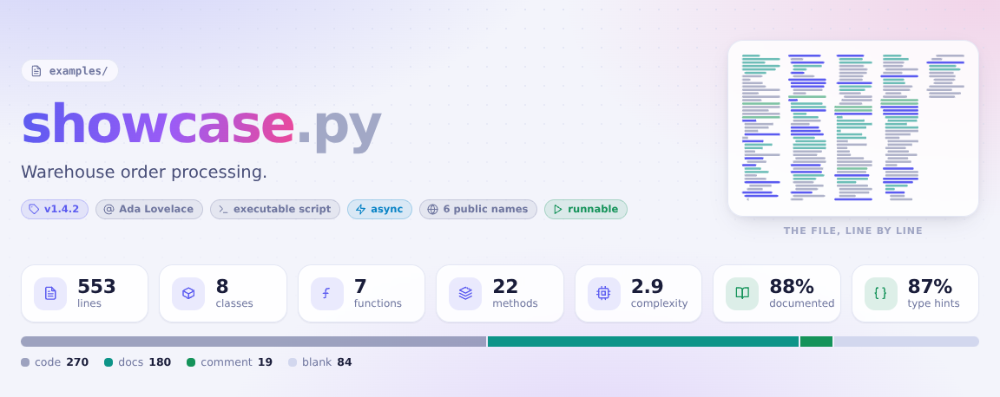
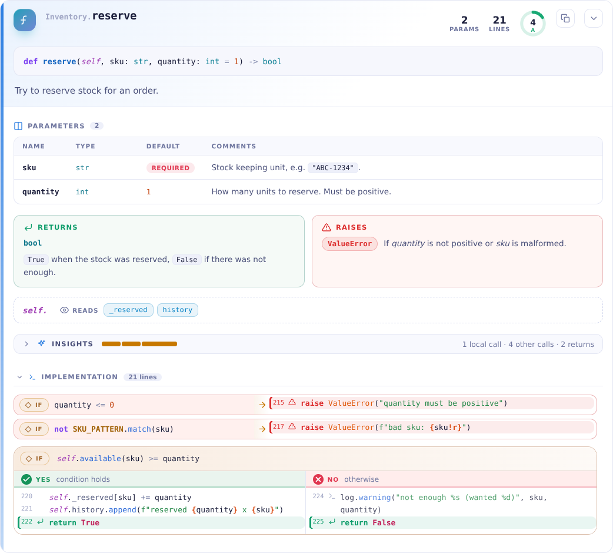
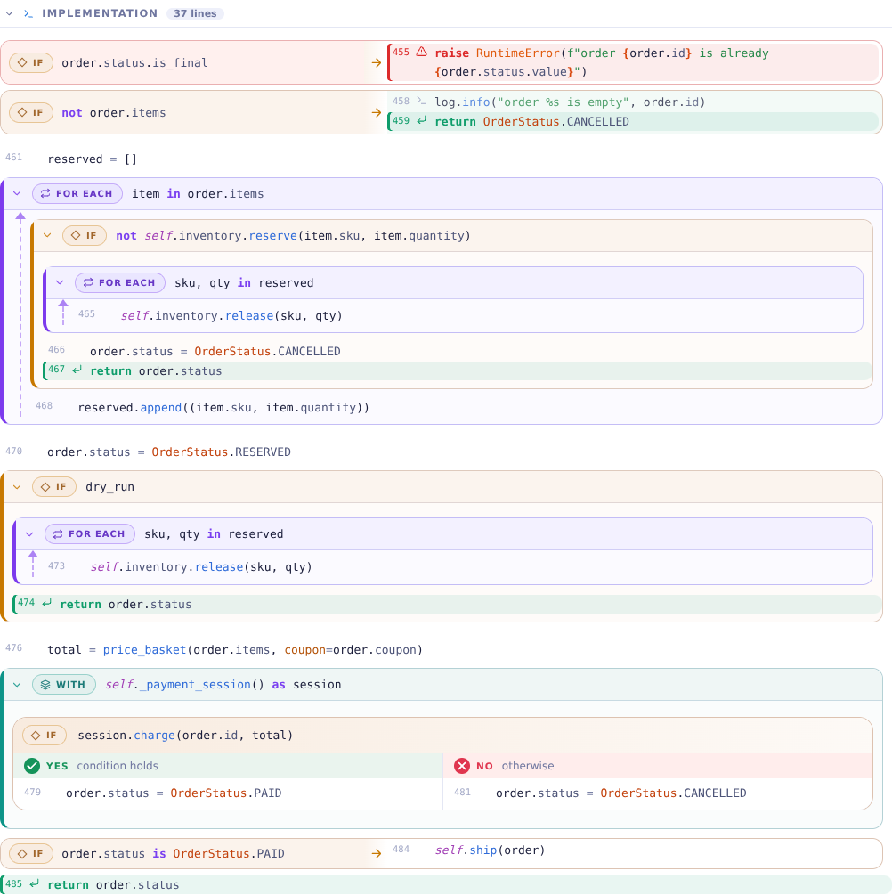
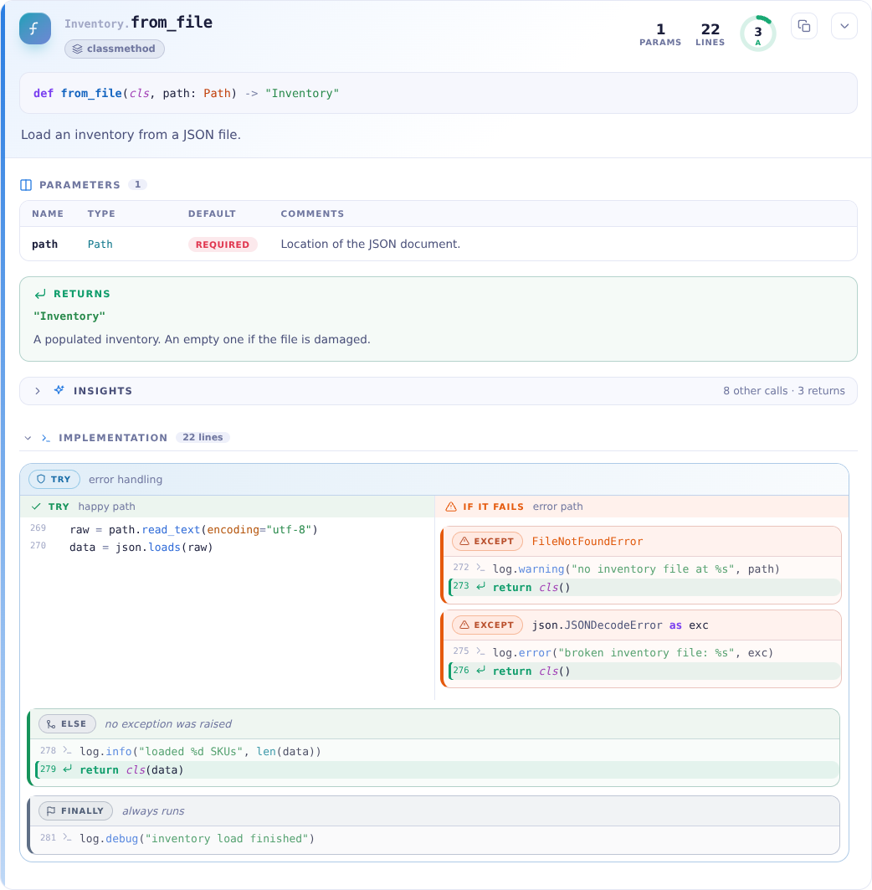
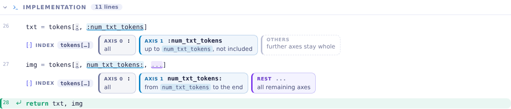
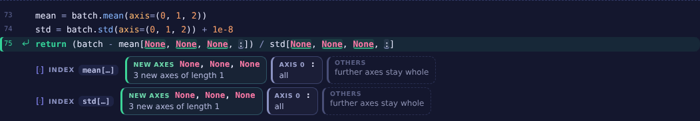
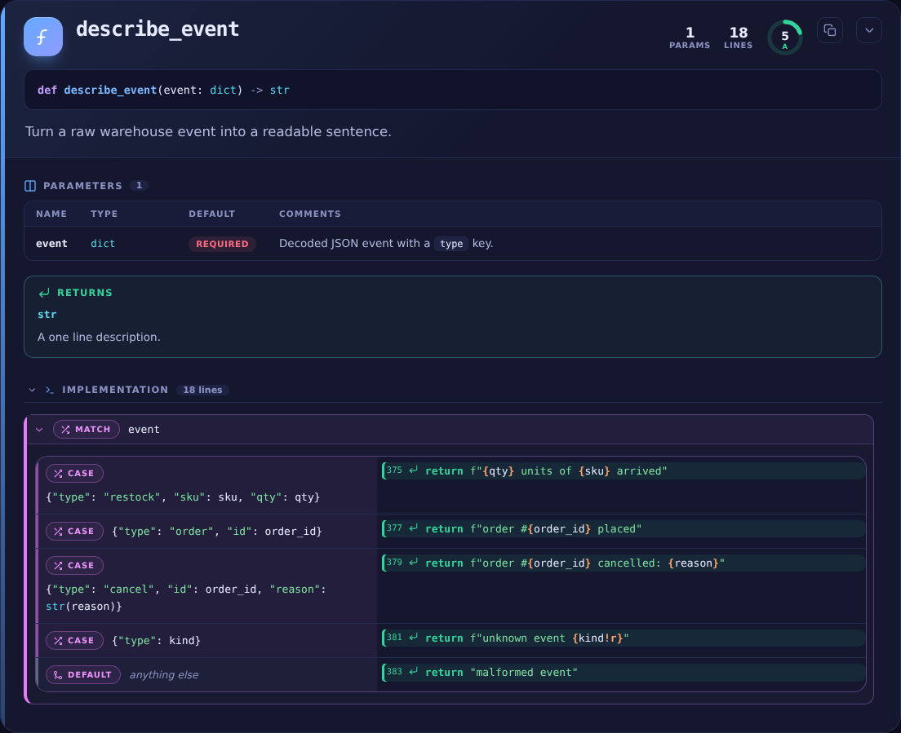
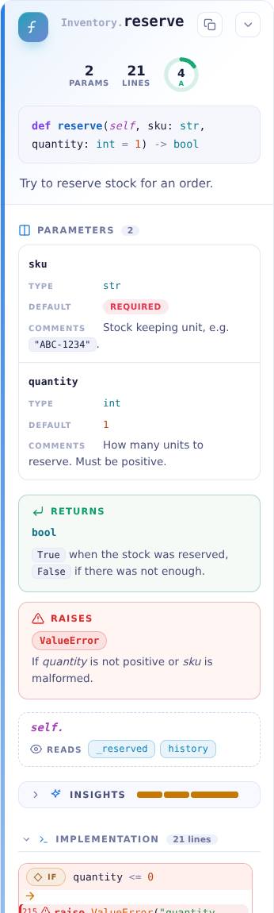

<h1 align="center">Python Beautifier</h1>

<p align="center"><b>Turn a Python file into a page that explains itself.</b></p>



Syntax highlighting makes code colourful. **Python Beautifier makes it readable.**
It reads a `.py` file, works out its structure, and writes **one self-contained HTML page**
(no server, no internet, no dependencies) in which:

- every class and function gets its own **header card**;
- a **parameters table** follows it: *name · type · default · comments*, filled in from the
  annotations, the docstring ("pydoc") and inline comments;
- the **body is drawn to follow the shape of the code**: a short `if`/`else` becomes two columns
  (**yes** on the left, **no** on the right), loops become frames, `try`/`except` becomes a
  happy-path lane next to a failure lane, and comments become notes;
- an **overview** with a code map, health gauges and a call diagram shows the whole module at a glance.

**See it:** [`examples/showcase.html`](examples/showcase.html) is generated from
[`examples/showcase.py`](examples/showcase.py), a 550-line warehouse-order module that uses every
construct. Download it and open it in a browser.

## Quick start

Python **3.10 or newer**. No third-party packages.

```bash
pip install .                      # from a checkout; adds the `pybeautify` command
pybeautify my_module.py --open     # writes my_module.html and opens it
```

Without installing:

```bash
python -m python_beautifier my_module.py -o my_module.html
```

From Python:

```python
from python_beautifier import beautify, beautify_file

html = beautify(open("my_module.py").read(), filename="my_module.py")   # -> str
beautify_file("my_module.py", "out/my_module.html", theme="dark")        # writes the file
```

## What you get

### A header and a parameters table for every definition



- **Header:** icon, `Class.method` name, badges (`async`, `generator`, `classmethod`, `property`,
  `abstract`, `private`, `deprecated`, `cached`, `recursive`, `dataclass`, `enum`, ...), size and
  complexity at a glance, the signature and the summary line.
- **Parameters table:** *Name | Type | Default | Comments*. Types come from annotations, then from
  the docstring, then (flagged as *inferred*) from the default value. Comments come from the
  docstring, or from a `# comment` next to the parameter. `self` and `cls` are left out.
- **Returns / Raises / Yields** panels, plus the attributes the method *reads* and *writes*.
- **Insights:** who calls it and whom it calls, a colour-coded "shape" bar of its statements, and
  a cyclomatic-complexity ring graded A to F.
- Classes get the same treatment: bases and subclasses, attribute and method tables, enum members,
  dataclass fields, and nested cards for their methods.
- Docstrings in **Google**, **NumPy**, **Sphinx/reST** and **Epytext** style are understood, and
  messy ones degrade gracefully into plain text.

### Bodies that look like the structure of the code



| Code | How it is drawn |
| --- | --- |
| short `if` / `else` | **two columns**: *yes* (left) and *no* (right) |
| `if` / `elif` / `else` | a decision ladder, one rung per condition |
| guard clause (`if x: return / raise / continue / break`) | a single row with an arrow to the outcome |
| branches too big to sit side by side | stacked, one after the other |
| long `and` / `or` conditions | broken into one row per operand |
| `for` / `while` | a violet frame with a loop-back rail |
| `try` / `except` / `else` / `finally` | lanes: happy path and failure path, one card per handler |
| `with` / `async with` | a teal frame |
| `match` / `case` | a table of patterns and what each one does |
| comments | notes in the flow; `TODO` / `FIXME` are also collected on a board |
| runs of imports and of class attributes | folded away, one click to open |
| nested functions and classes | their own nested cards |
| NumPy / PyTorch / pandas subscripts such as `x[:, n:, ...]` | every term underlined by kind, and a strip that explains each axis ([below](#array-indexing-you-can-actually-read)) |



### Array indexing you can actually read

`img = tokens[:, num_txt_tokens:, ...]` packs a whole-axis colon, a slice and an ellipsis into one
pair of brackets, and real code adds `None`, negative numbers, steps and masks. Here every comma
separated term of such a subscript is underlined by kind, and a strip under the statement explains
the terms in the same order as the code. Point at a term and its explanation lights up (and the
other way round).



| Term | Reads as |
| --- | --- |
| `:` | all of this axis |
| `n:` `:n` `a:b` `::2` `::-1` `-3:` `:-1` | from `n` to the end, up to `n`, `a` up to `b`, every 2nd item, reversed, the last 3, all but the last item (length-one slices say "axis kept") |
| `...` | all remaining axes; terms after it are numbered from the end (`axis −1`) |
| `None`, `np.newaxis` | a new axis of length 1 (it does not use up an axis of the array) |
| `0`, `-1`, `i` | pick one position; an integer removes the axis |
| `x > 0`, `~m`, `[0, 2]` | a boolean mask, or positions to gather |
| `df.loc[...]`, `df.iloc[...]` | rows and columns; `.loc` slices go by label and include their end |

Runs such as `m[None, None, None, :]` share one cell. The strip sits under simple statements, and above
the `if` (with its `elif`s), `while`, `for`, `with` or `match` block whose header indexes (module-level
headers only get the underlines). The code itself is never altered: what you read is exactly what
was written. The **Indexing** button in the toolbar switches it all off.

<p align="center"></p>

This works from syntax alone, so it is honest about what it cannot know: in `x[:, idx]` the name
`idx` may be an integer, an index array or a mask, which is why it says "index with `idx`", and a
multi-dimensional boolean mask uses up several axes, which the axis numbers cannot account for.
Ordinary Python (`xs[0]`, `s[1:]`, `d["key"]`, `grid[r, c]`) and type subscripts
(`Dict[str, int]`, `tuple[int, ...]`) are left alone. A slice among several terms, or `np.newaxis`,
always counts; a bare `...` or `None` counts only in files that import an array library (NumPy,
PyTorch, JAX, pandas, ...), because `handlers[None]` is just a dictionary lookup and pyparsing's
`expr[1, ...]` means "one or more". See
[`examples/tensor_indexing.html`](examples/tensor_indexing.html), generated from
[`examples/tensor_indexing.py`](examples/tensor_indexing.py), for 26 real-world subscripts.

### The whole module at a glance


Above the cards: the module docstring, a **code map** (every box is a definition, area = lines of
code, colour = complexity), a **health** panel (docstring and type-hint coverage, complexity
distribution, hot spots), a **"who calls whom"** chord diagram, the public API, imports grouped into
standard library / third party / local, a constants table and the to-do board.

### Light, dark, phone, print

<p align="center">
  
  
</p>

The theme follows your OS (switchable in the page). Tables turn into stacked rows on narrow
screens, and there is a print stylesheet for paper or PDF.

### Small conveniences

Outline sidebar with scroll-spy, search (press <kbd>/</kbd>), expand / collapse all, line-number
and comment toggles, a copy button on every card (it copies that definition's original source),
hover a name to highlight its other uses in the same card, and deep links such as
`#d-Inventory.reserve` that open the card they point to. Without JavaScript the page is still
fully readable.

## Command line

```text
pybeautify [-h] [-o OUT.html | -d DIR] [--theme {auto,light,dark}]
           [--title TITLE] [--open] [-q] [--version]
           FILE [FILE ...]
```

| Option | Meaning |
| --- | --- |
| `FILE ...` | Python files to beautify; `-` reads standard input |
| `-o`, `--output` | output file (single input only) |
| `-d`, `--out-dir` | write `<name>.html` for every input into this directory |
| *(neither)* | the page is written next to the input as `FILE.html` (`stdin.html` for `-`) |
| `--theme` | initial theme: `auto` (follow the OS, default), `light` or `dark` |
| `--title` | page title (default: the file name) |
| `--open` | open the result in your browser |
| `-q`, `--quiet` | no progress messages |

Exit status: `0` success; `1` a file has a syntax error or could not be processed (an HTML page
that explains the problem is still written); `2` a file could not be read or written.

## How layout decisions are made

Structure decides the layout, and the page decides whether it fits:

- A branch is drawn side by side only if it is small: at most 10 rows per column, columns up to
  about 58 characters wide, and no more than two side-by-side layouts nested inside each other.
  Bigger branches stack.
- Column widths come from the code itself, and CSS decides at view time: two columns appear
  whenever two of them fit into the space available, otherwise they stack. So the same page
  adapts to a wide monitor, a split window or a phone without re-rendering.
- Lines up to about 15 % longer than a column wrap instead of forcing a stack.

All thresholds are named constants at the top of
[`python_beautifier/render/flow.py`](python_beautifier/render/flow.py).

## Good to know

- **Static analysis only.** Your code is parsed, never imported or run. The call graph covers
  calls between definitions *in the same file*; types are read from annotations and docstrings, or
  inferred from default values (and labelled as inferred).
- **Parsing uses the running interpreter's grammar**, so a file using newer syntax than your Python
  (for example `except*` before 3.11, or PEP 695 generics before 3.12) shows an error page.
  Files that do not parse, contain null bytes or nest code absurdly deep produce an explanatory
  page instead of a traceback; undecodable bytes are shown as `�`.
- **Size:** the page is roughly 10 to 15 times the size of the source, plus about 100 kB of built-in
  CSS, JS and icons. The showcase (17 kB of Python) becomes about 400 kB.
- **Fully offline:** system fonts, inline CSS, JS and SVG. No external requests.
- `examples/showcase.py` is meant for reading, not running (it imports `requests` and a relative
  `.config` module that do not exist here); that is fine, because nothing is ever executed.

## Development

```bash
python -m venv .venv && . .venv/bin/activate
pip install -e . pytest
pytest                                                    # 330+ tests, a few seconds
python -m python_beautifier examples/showcase.py -o examples/showcase.html   # refresh the examples
python -m python_beautifier examples/tensor_indexing.py -o examples/tensor_indexing.html
```

The tests cover the docstring parser, the analysis, the structure of the output and the CLI. The
central guarantee is tested too: **every character of the source appears in the page exactly once**
(for the showcase, for 45 standard-library modules and for a set of awkward snippets), so the page
can never silently drop or duplicate code. Pathological input is tested as well.
The screenshots in `docs/` were captured from the two example pages with headless Chromium.

```text
python_beautifier/
  cli.py  __main__.py  __init__.py    command line and the beautify() API
  source.py highlight.py              source text, tokens, lossless syntax highlighting
  docstrings.py                       Google / NumPy / Sphinx / Epytext parser
  model.py analysis.py                definitions, parameters, complexity, types, call graph
  indexing.py                         decodes NumPy / PyTorch style subscripts, axis by axis
  render/                             flow.py (bodies), cards.py (headers, tables),
                                      widgets.py (charts), index.py (indexing strips),
                                      core.py (page), prose.py, icons.py
  assets/                             base.css, cards.css, flow.css, app.js (inlined into the page)
examples/                             showcase.py and tensor_indexing.py, with their generated pages
tests/
```
